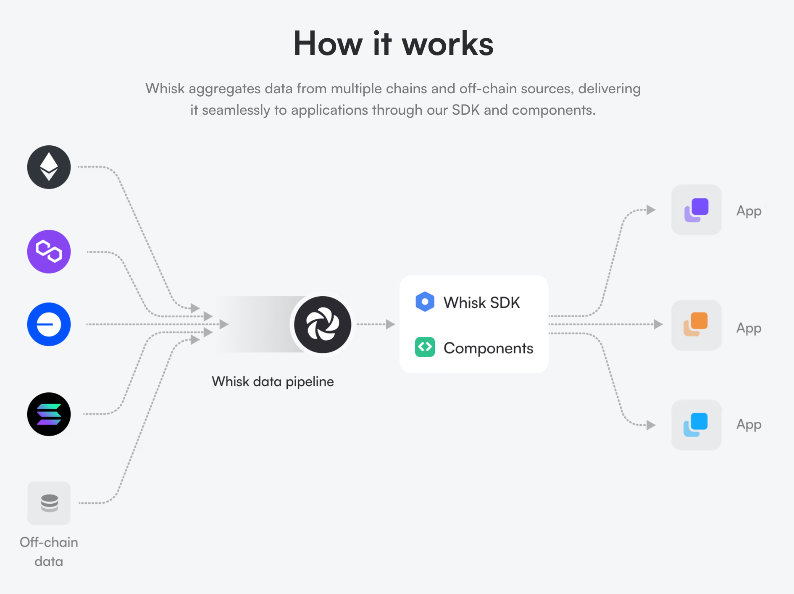

# Whisk SDK

Whisk SDK provides a suite of modular kits for seamless integration with the [Whisk.so](https://whisk.so) blockchain data pipeline.

## Documentation 

For documentation and guides, visit [docs.whisk.so](https://www.docs.whisk.so)

